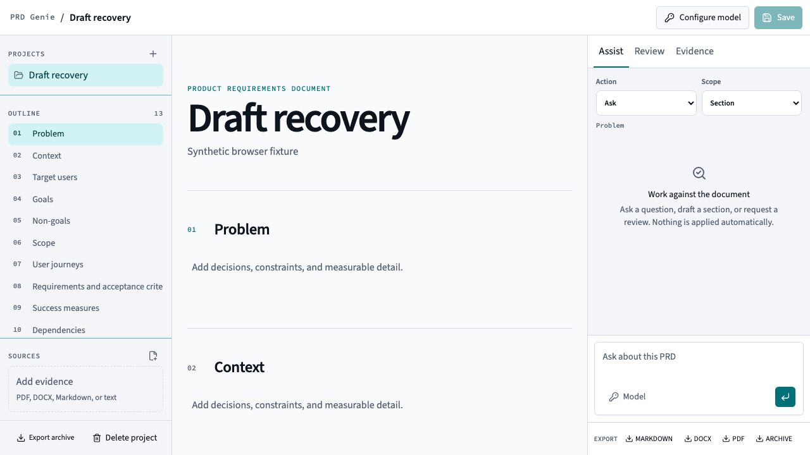
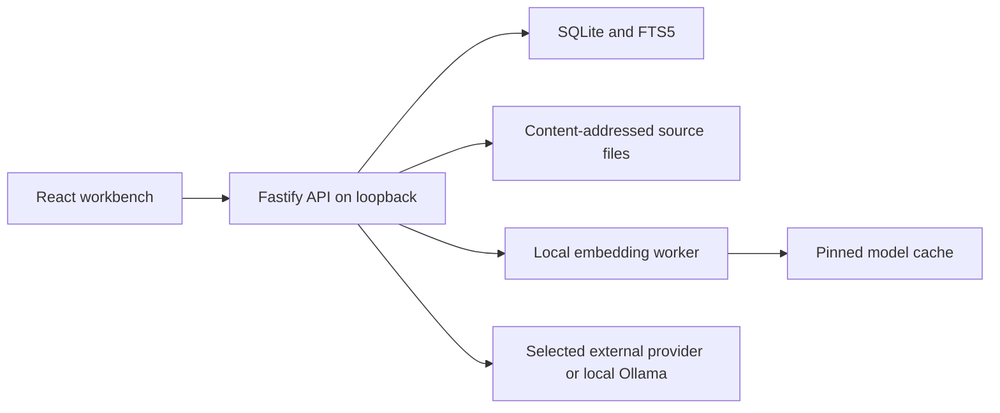

# PRD Genie

PRD Genie is a local-first workbench for turning source material and rough thinking into a review-ready product requirements document. It combines a structured editor, evidence retrieval, explicit AI proposals, and a revision-aware review workflow.

This repository is an independent implementation with synthetic fixtures only.

## What it does

- Creates a structured PRD with stable, reorderable sections.
- Imports Markdown, DOCX, and plain-text PRDs.
- Indexes PDF, DOCX, Markdown, and plain-text sources locally.
- Combines lexical and local semantic retrieval, with an automatic lexical fallback.
- Connects directly to a provider using a session key or environment fallback.
- Previews every AI rewrite or review finding before it changes the PRD.
- Records revisions, citations, provider, model, action, scope, and source revision.
- Exports and restores a portable project archive with revision and evidence history.
- Creates a revision-bound handoff for optional use with the included ChatGPT skills plugin.

## Status

The public `v0.1.0-rc.1` release is an early candidate, not a finished product claim. Development changes are validated against the exact release commit before a later candidate is promoted. See [Quality and model evaluation](docs/QUALITY.md) for the evidence rules and current limitations.

No adoption, universal accuracy, native desktop packaging, or unattended document-quality claim is made. Every model output remains a reviewable proposal.



## Quick start

Requirements:

- Node.js 22 or 24
- npm 10 or later
- Enough disk space for the local embedding model cache

```bash
npm ci
npm run dev
```

Open `http://127.0.0.1:5173`. The API listens on `http://127.0.0.1:3210` in development.

For a production build:

```bash
npm run build
npm start
```

The production application listens only on `http://127.0.0.1:3210` by default.

## Provider matrix

| Provider          | Session key  | Environment fallback           | Model discovery | Custom model ID |
| ----------------- | ------------ | ------------------------------ | --------------- | --------------- |
| OpenAI            | Yes          | `OPENAI_API_KEY`               | Yes             | Yes             |
| Anthropic         | Yes          | `ANTHROPIC_API_KEY`            | Yes             | Yes             |
| Google Gemini     | Yes          | `GOOGLE_GENERATIVE_AI_API_KEY` | Yes             | Yes             |
| OpenAI-compatible | Optional     | `OPENAI_COMPATIBLE_API_KEY`    | When supported  | Yes             |
| Local Ollama      | Not required | Not required                   | Yes             | Yes             |

OpenAI-compatible endpoints use `OPENAI_COMPATIBLE_BASE_URL` as an optional environment fallback. Ollama uses `OLLAMA_BASE_URL` or `http://127.0.0.1:11434/v1`.

The application talks directly to these providers. It does not use an intermediary model gateway.

## ChatGPT plan usage

A ChatGPT Plus, Pro, Business, Enterprise, or other ChatGPT plan does not provide API credentials or API usage to this standalone application. PRD Genie never asks for ChatGPT cookies or automates a ChatGPT browser session.

The repository includes a skills-only ChatGPT plugin and a manual, revision-bound file handoff. A user can choose the exact PRD sections and evidence excerpts to export, use the plugin in a supported ChatGPT surface, and import the response as a staged proposal. The local app validates project, revision, section hashes, evidence IDs, request digest, response size, and replay state before any proposal can be applied.

See [ChatGPT integration](docs/CHATGPT_INTEGRATION.md) for installation boundaries, privacy, and limitations.

## Privacy and outbound data

Local project data, extracted source text, revisions, citations, AI history, review findings, and ChatGPT handoff records are stored in SQLite. Source binaries are stored by content hash in the application data directory.

For an AI action, the server sends only:

1. The action instruction.
2. The selected PRD scope.
3. Up to eight retrieved source excerpts within the action budget.

Before provider setup, the interface shows the provider hostname and these data classes. Session keys are held in server memory behind an opaque, HttpOnly, same-site cookie. They expire after eight idle hours and disappear on server restart, browser-session expiry, or explicit clearing.

Keys are not written to SQLite, browser storage, URLs, logs, analytics, exports, or error responses. There is no telemetry and there are no third-party runtime scripts or fonts.

Project files and SQLite data rely on operating-system disk protection. They are not independently encrypted. See [Privacy](docs/PRIVACY.md) and [Threat model](docs/THREAT_MODEL.md).

## Supported files

| Operation       | Supported                                     |
| --------------- | --------------------------------------------- |
| PRD import      | Markdown, DOCX, plain text                    |
| Evidence source | PDF, DOCX, Markdown, plain text               |
| Export          | Markdown, DOCX, PDF, portable project archive |
| Project restore | PRD Genie portable project archive            |

Legacy Word files, spreadsheets, presentations, images, encrypted PDFs, mismatched file signatures, and unsupported archives are rejected with an explicit client error.

English is the v1 retrieval target.

## Architecture



The client, server, and shared contracts are one strict TypeScript package. Fastify serves the compiled Vite client in production. See [Architecture](docs/ARCHITECTURE.md).

## Data directories

The default location follows the operating system application-data convention. Override it with:

```bash
PRD_GENIE_DATA_DIR=/path/to/data npm start
```

Override the model cache separately with `PRD_GENIE_MODEL_CACHE_DIR`.

## Docker

```bash
docker compose up --build
```

The compose file publishes the container only on `127.0.0.1`, and persists both `/data` and `/models`.

## Quality commands

```bash
npm run content:check
npm run format:check
npm run lint
npm run typecheck
npm test
npm run test:coverage
npm run build
```

End-to-end browser tests require the supported browser binaries:

```bash
npx playwright install
npm run test:e2e
```

Run the complete release gate locally:

```bash
npm run ci:offline
```

The authoritative release gate runs outside GitHub Actions. Checked-in workflow definitions request self-hosted runners, but repository plan, storage, and GitHub service charges remain account-dependent. See [Offline CI](docs/OFFLINE_CI.md).

## Limitations

- Single-user local self-hosting only.
- No authentication, remote hosting, multi-user collaboration, or cloud sync.
- English-first retrieval.
- Semantic retrieval downloads a pinned local model on first use.
- If the model cannot initialise, retrieval continues in a clearly labelled lexical-only mode.
- Imported legacy browser data is not migrated.
- PRD Genie is a local browser application served by Node.js. It is not currently distributed as a signed macOS app, Windows installer, or Linux desktop package.
- ChatGPT plugin availability and file handling vary by plan, region, workspace policy, and supported ChatGPT surface.
- Output quality varies by provider and model. Every proposal requires human review and explicit acceptance.

## Troubleshooting

**The health endpoint is degraded**

The embedding model is not initialised or could not load. Lexical retrieval remains available. Check model-cache permissions and outbound access to the model host.

**A provider returns missing credentials**

Open Model provider and configure a session key, or set the documented environment fallback before starting the server.

**A custom endpoint is rejected**

Remote endpoints must use HTTPS. Plain HTTP is accepted only for loopback hosts. Credentials embedded in URLs are always rejected.

**An AI proposal became stale**

The PRD revision changed after the proposal was generated. Run the action again against the current revision.

**A restored project shows lexical-only indexing**

Portable archives omit embeddings. Lexical search is ready after restore. Use the source retry action after the local embedding model becomes available.

## Contributing and security

See [Contributing](CONTRIBUTING.md), [Security](SECURITY.md), [Support](SUPPORT.md), and the [Roadmap](ROADMAP.md).

## License

MIT. Model, font, archive, and dependency notices are documented in [Third-party notices](THIRD_PARTY_NOTICES.md) and the generated license inventory.
