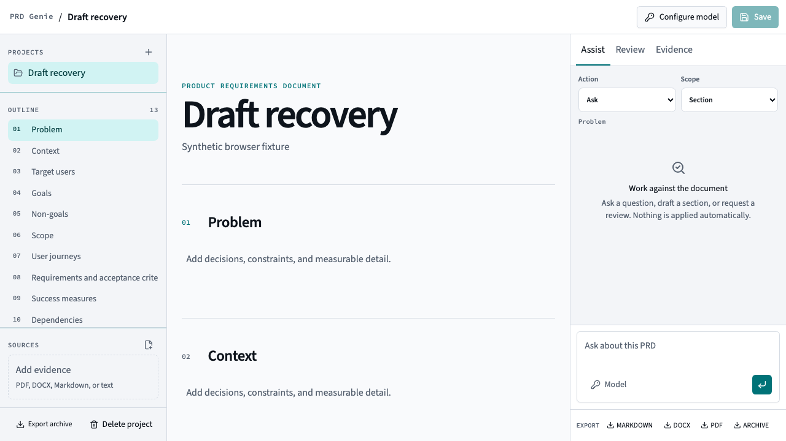
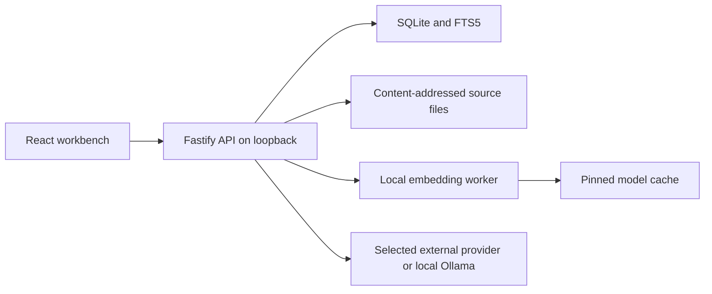

# PRD Genie

PRD Genie is a local-first workbench for turning source material and rough thinking into a review-ready product requirements document. It combines a structured editor, evidence retrieval, explicit AI proposals, and a revision-aware review workflow.

This repository is an independent implementation.

## What it does

- Creates a structured PRD with stable, reorderable sections.
- Imports Markdown, DOCX, and plain-text PRDs.
- Indexes PDF, DOCX, Markdown, and plain-text sources locally.
- Combines lexical and local semantic retrieval, with an automatic lexical fallback.
- Connects directly to a provider using a session key or environment fallback.
- Previews every AI rewrite or review finding before it changes the PRD.
- Records revisions, citations, provider, model, action, scope, and source revision.
- Exports and restores a portable project archive with revision and evidence history.
- Creates a revision-bound handoff for optional use with the included ChatGPT skills plugin.

## Status

The latest packaged release is [v0.1.0-rc.3](https://github.com/prashanthnimmagadda/prd-genie/releases/tag/v0.1.0-rc.3), an early candidate. The `main` branch includes subsequent onboarding, dependency, and browser fixes listed under [Unreleased](CHANGELOG.md#unreleased). The Quick start below installs `main`; RC.3 downloads do not contain those later fixes. See [Quality and model evaluation](docs/QUALITY.md) for evidence rules and limitations.

No adoption, universal accuracy, native desktop packaging, or unattended document-quality claim is made. Every model output remains a reviewable proposal.



## Quick start

Install [Git](https://git-scm.com/downloads) and [Node.js 22 or 24](https://nodejs.org/en/download) first. Node includes npm; use npm 10 or later. Open Terminal on macOS/Linux or PowerShell on Windows and check:

```bash
git --version
node --version
npm --version
```

Allow at least 1.5 GB of free disk space for a source installation, plus space for your documents. A measured macOS installation used about 945 MB for dependencies and 23 MB for the embedding model; sizes vary by platform. Internet access is required for installation and the model's first download. Provider API use needs that provider's credentials and may incur separate charges.

Run these commands one line at a time:

```bash
git clone https://github.com/prashanthnimmagadda/prd-genie.git
cd prd-genie
npm ci
npm run build
npm start
```

Open [http://127.0.0.1:3210](http://127.0.0.1:3210) in a browser on the same computer. You should see **Start with the document, not a chat.** Keep the terminal running while using PRD Genie. This is a local browser app, not a desktop installer or hosted service.

To stop, save your edits and press **Ctrl+C** in the terminal. To return, open a terminal in the `prd-genie` folder, run `npm start`, and reopen the URL. Projects persist; session provider keys must be configured again after a server restart.

For code development with automatic reload, use this instead of `npm start`:

```bash
npm run dev
```

Development opens at [http://127.0.0.1:5173](http://127.0.0.1:5173), with the API on port 3210. Run only one server per data directory.

## Your first PRD in about ten minutes

Start after installation. Model downloads and provider response times may take longer.

1. Enter your project's name and click **Create project**. You can also use **Import an existing PRD** with a Markdown, DOCX, or plain-text document.
2. Select **Problem** in the document outline. Describe the problem you want to address in one or two sentences. Save your edits using **Save**.
3. Use **Add source** to upload a requirements brief, research notes, or a decision record you are permitted to use. Supported formats are PDF, DOCX, Markdown, and plain text. Choose material relevant to the problem you wrote; the app cannot ground a proposal in evidence you have not supplied. Wait for its status to become **ready**. The first upload may download the local embedding model. A partial status can mean incomplete extraction or unavailable semantic indexing. Read its warning; lexical search remains available when embeddings cannot load. Retry indexing after resolving the reported cause.
4. Click **Configure model** in the top bar (accessible name: **Configure model provider**). Choose your provider, enter its API key under **Session key**, and click **Configure and discover**. Click **Choose a model**, select an available model, close the model chooser, and click **Use provider**. If discovery is unavailable, enter a valid model ID in **Or enter a model ID** before **Use provider**. For a local Ollama server, choose **Local Ollama**, use `http://127.0.0.1:11434/v1`, and select an already installed model. See the [provider matrix](#provider-matrix). A ChatGPT subscription is not an API key.
5. In **assist**, choose **Rewrite**, set **Scope** to **Section**, and keep **Problem** selected. Enter: “Rewrite the problem using the evidence. Keep it concise and do not invent business impact.” Submit the instruction.
6. Read the proposed text and its citations. Compare each cited excerpt with your source. Choose **Apply** (the accessible name identifies the target, such as **Apply to Problem**) to accept it, or dismiss it. The document changes only after acceptance. **Undo** is available for the immediately applied revision.
7. Use **Export** to download Markdown, DOCX, or PDF. Use **Export archive** for a portable backup that includes sources and revision history. Inspect the exported document before sharing it.
8. Stop and restart the app using the Quick start instructions. Reopen your project to confirm your saved work is present. Reconfigure the provider session before another AI action.

AI actions send the instruction, selected PRD scope, and retrieved excerpts to your selected provider. See [Privacy and outbound data](#privacy-and-outbound-data) before adding confidential material.

## Provider matrix

| Provider          | Session key  | Environment fallback           | Model discovery | Custom model ID |
| ----------------- | ------------ | ------------------------------ | --------------- | --------------- |
| OpenAI            | Yes          | `OPENAI_API_KEY`               | Yes             | Yes             |
| Anthropic         | Yes          | `ANTHROPIC_API_KEY`            | Yes             | Yes             |
| Google Gemini     | Yes          | `GOOGLE_GENERATIVE_AI_API_KEY` | Yes             | Yes             |
| OpenAI-compatible | Optional     | `OPENAI_COMPATIBLE_API_KEY`    | When supported  | Yes             |
| Local Ollama      | Not required | Not required                   | Yes             | Yes             |

OpenAI-compatible endpoints use `OPENAI_COMPATIBLE_BASE_URL` as an optional environment fallback. Ollama uses `OLLAMA_BASE_URL` or `http://127.0.0.1:11434/v1`.

The application talks directly to these providers. It does not use an intermediary model gateway.

Session setup in the interface is the simplest option. Environment fallbacks are optional: `.env.example` is a reference, and PRD Genie does **not** automatically load a `.env` file. If you choose file-based configuration, copy `.env.example` to `.env`, remove unused empty entries, add only the required values, then start the built server with `node --env-file=.env dist/server/server/index.js`. Keep that file private; it contains plaintext credentials and is ignored by Git. For Docker, use the session interface unless you explicitly configure container environment variables.

## ChatGPT plan usage

A ChatGPT Plus, Pro, Business, Enterprise, or other ChatGPT plan does not provide API credentials or API usage to this standalone application. PRD Genie never asks for ChatGPT cookies or automates a ChatGPT browser session.

The repository includes a skills-only ChatGPT plugin and a manual, revision-bound file handoff. A user can choose the exact PRD sections and evidence excerpts to export, use the plugin in a supported ChatGPT surface, and import the response as a staged proposal. The local app validates project, revision, section hashes, evidence IDs, request digest, response size, and replay state before any proposal can be applied.

See [ChatGPT integration](docs/CHATGPT_INTEGRATION.md) for installation boundaries, privacy, and limitations.

## Privacy and outbound data

Local project data, extracted source text, revisions, citations, AI history, review findings, and ChatGPT handoff records are stored in SQLite. Source binaries are stored by content hash in the application data directory.

For an AI action, the server sends only:

1. The action instruction.
2. The selected PRD scope.
3. Up to eight retrieved source excerpts within the action budget.

Before provider setup, the interface shows the provider hostname and these data classes. Session keys are held in server memory behind an opaque, HttpOnly, same-site cookie. Closing the browser removes the session cookie and access to its entry. The in-memory entry is removed on explicit clearing, server restart, or the next access after eight idle hours.

Keys are not written to SQLite, browser storage, URLs, logs, analytics, exports, or error responses. There is no telemetry and there are no third-party runtime scripts or fonts.

Project files and SQLite data rely on operating-system disk protection. They are not independently encrypted. See [Privacy](docs/PRIVACY.md) and [Threat model](docs/THREAT_MODEL.md).

## Supported files

| Operation       | Supported                                     |
| --------------- | --------------------------------------------- |
| PRD import      | Markdown, DOCX, plain text                    |
| Evidence source | PDF, DOCX, Markdown, plain text               |
| Export          | Markdown, DOCX, PDF, portable project archive |
| Project restore | PRD Genie portable project archive            |

Legacy Word files, spreadsheets, presentations, images, encrypted PDFs, mismatched file signatures, and unsupported archives are rejected with an explicit client error.

English is the v1 retrieval target.

## Architecture


```mermaid
flowchart LR
  Browser["React workbench"] --> API["Fastify API on loopback"]
  API --> DB["SQLite and FTS5"]
  API --> Files["Content-addressed source files"]
  API --> Worker["Local embedding worker"]
  Worker --> Cache["Pinned model cache"]
  API --> Provider["Selected external provider or local Ollama"]
```

The client, server, and shared contracts are one strict TypeScript package. Fastify serves the compiled Vite client in production. See [Architecture](docs/ARCHITECTURE.md).

## Data directories

Default data locations (including the SQLite database, sources, and model cache):

| System  | Directory                                           |
| ------- | --------------------------------------------------- |
| macOS   | `~/Library/Application Support/prd-genie-nodejs`    |
| Linux   | `${XDG_DATA_HOME:-~/.local/share}/prd-genie-nodejs` |
| Windows | `%LOCALAPPDATA%\prd-genie-nodejs\Data`              |

Override it on macOS/Linux with:

```bash
PRD_GENIE_DATA_DIR=/path/to/data npm start
```

Override the model cache separately with `PRD_GENIE_MODEL_CACHE_DIR`.

In PowerShell, set `$env:PRD_GENIE_DATA_DIR = 'C:\path\to\data'` before `npm start`. Keep the same path on subsequent starts to reopen the same projects.

### Back up, update, or uninstall

Export a portable archive for each project before updating. For a complete backup, stop the server and copy the entire data directory to a private backup location. Include a separately configured model cache if you want to avoid downloading it again. Never copy an actively written SQLite database as your only backup.

For the `main` installation above, stop the server, open the repository directory, and run:

```bash
git status --short
git pull --ff-only
npm ci
npm run build
npm start
```

If `git status` shows your own edits, preserve them before pulling. If `git pull` refuses, do not force it or reset your work. Review [CHANGELOG.md](CHANGELOG.md) before updating. Rollback requires the matching code and a backup of the database and sources from before the update; older code does not downgrade the database.

To uninstall, stop the app and remove its cloned repository folder. Project data remains in the directory above. Remove that separate directory only if you intend to erase the projects and have checked your backups. An **Export archive** backup can be brought back with **Restore archive**.

## Containers

The same Dockerfile builds a Linux image with Apple Container or Docker. The Apple Container commands below select ARM64; Docker Compose builds for the Docker host's native architecture. The recorded container validation uses Apple Container on an Apple silicon Mac. See [verification coverage](docs/QUALITY.md#verification-coverage) for the exact execution boundaries.

### Apple Container on macOS

Use an Apple silicon Mac running macOS 26 and install Apple's signed [Container package](https://github.com/apple/container#initial-install). Clone this repository and enter `prd-genie` as in Quick start. Host Node and Docker Desktop are not required for this route.

```bash
container system start
container build --platform linux/arm64 --tag prd-genie:local .
container volume create prd-genie-data
container volume create prd-genie-models
container run --detach --name prd-genie --publish 127.0.0.1:3210:3210 --volume prd-genie-data:/data --volume prd-genie-models:/models prd-genie:local
```

Create the named volumes only on the first installation. If the container or volumes already exist, use the restart or update instructions below rather than recreating them. Open [http://127.0.0.1:3210](http://127.0.0.1:3210) and follow the first-PRD walkthrough. Configure your provider in the interface.

- Logs: `container logs prd-genie`.
- Stop: `container stop --signal SIGTERM --time 10 prd-genie`.
- Resume: `container start prd-genie`.
- Stop the engine after stopping its containers: `container system stop`. This affects all containers managed by that engine; leave it running if another application needs it.

To update, export your project archives, stop `prd-genie`, and run `git pull --ff-only` in the repository. Rebuild with the `container build` command above, then run `container delete prd-genie` and repeat only the `container run` command. Deleting the stopped container retains the named data and model volumes. Do not delete those volumes during an update. Run `container system start` first if you previously stopped the engine.

The automated maintainer check is `npm run container:record-smoke`. It uses isolated temporary names and removes only its own container, image, and volumes. It checks health, loopback Host rejection, unprivileged Node PID 1, restart persistence, graceful shutdown, and cleanup.

### Docker Compose

Install and start [Docker Engine or Docker Desktop with Compose](https://docs.docker.com/compose/install/). Verify `docker --version` and `docker compose version`. Clone the repository and enter `prd-genie` as in Quick start. Docker builds Node and dependencies inside the image; a host Node installation is not needed for this route.

```bash
docker compose up --build -d
```

Open [http://127.0.0.1:3210](http://127.0.0.1:3210) and follow the first-PRD walkthrough. Configure provider keys in the interface. The compose file publishes only on `127.0.0.1` and persists `/data` and `/models` in named volumes. Do not run the native server on the same port at the same time.

Use `docker compose logs --tail=100 prd-genie` to inspect startup, `docker compose stop` to stop, and `docker compose start` to resume. To update, export project archives, stop the container, run `git pull --ff-only`, and run `docker compose up --build -d` again. `docker compose down` removes the container while retaining data volumes; adding `--volumes` deletes those backups of app state and must not be part of a routine update.

### Container networking and storage

Inside either container runtime, `127.0.0.1` refers to the container itself. These configurations do not connect to Ollama on the host, and PRD Genie's endpoint policy rejects private non-loopback addresses. Use the native installation for a local host Ollama server. Containers require additional disk space for images and build layers. Keep each runtime's data volumes separate; use **Export archive** and **Restore archive** to move projects between installations.

## Quality commands

```bash
npm run content:check
npm run format:check
npm run lint
npm run typecheck
npm test
npm run test:coverage
npm run build
```

End-to-end browser tests require the supported browser binaries:

```bash
npx playwright install
npm run test:e2e
```

Run the complete release gate locally:

```bash
npm run ci:offline
```

The authoritative release gate runs outside GitHub Actions. Repository Actions remain disabled, and checked-in workflow templates are manual-only, so pushes and pull requests cannot create CI billing or execute code on a maintainer machine. See [Offline CI](docs/OFFLINE_CI.md).

## Limitations

- Single-user local self-hosting only.
- Run one PRD Genie server process per application data directory. Sharing one data directory across concurrent processes is unsupported.
- No authentication, remote hosting, multi-user collaboration, or cloud sync.
- English-first retrieval.
- Semantic retrieval downloads a pinned local model on first use.
- If the model cannot initialise, retrieval continues in a clearly labelled lexical-only mode.
- Imported legacy browser data is not migrated.
- PRD Genie is a local browser application served by Node.js. It is not currently distributed as a signed macOS app, Windows installer, or Linux desktop package.
- ChatGPT plugin availability and file handling vary by plan, region, workspace policy, and supported ChatGPT surface.
- Output quality varies by provider and model. Every proposal requires human review and explicit acceptance.

## Troubleshooting

**The health endpoint is degraded**

Inspect the structured `/api/health` response. If retrieval is degraded, the embedding model is not initialised or could not load and lexical retrieval remains available. Check model-cache permissions and outbound access to the model host. If `fileCleanup.status` is `pending`, a source binary could not be removed. Correct the application data directory permissions and restart PRD Genie to retry the durable cleanup job.

**A provider returns missing credentials**

Click **Configure model provider** and configure a session key, or set the documented environment fallback before starting the server. Keys expire after restart or eight idle hours; the saved model name does not mean the session credential is still available.

**A command is not found or installation fails**

Reopen the terminal after installing Git or Node and check the three versions in Quick start. Run commands from the cloned `prd-genie` directory. If a native dependency cannot download a prebuilt binary, it may require your platform's C/C++ build tools and Python. Report the first failing package and redacted error through [Support](SUPPORT.md).

**The page will not open or the port is already in use**

Keep the server terminal open and check its startup output. Use port 3210 for `npm start` and 5173 for `npm run dev`. Stop your other PRDG process before restarting; do not run native and Docker installations on port 3210 together.

**A custom endpoint is rejected**

Remote endpoints must use HTTPS and resolve only to public addresses. Plain HTTP is accepted only for loopback hosts. Redirects and credentials embedded in URLs are rejected.

**An AI proposal became stale**

The PRD revision changed after the proposal was generated. Run the action again against the current revision.

**A restored project shows lexical-only indexing**

Portable archives omit embeddings. Lexical search is ready after restore. Use the source retry action after the local embedding model becomes available.

## Contributing and security

See [Contributing](CONTRIBUTING.md), [Security](SECURITY.md), [Support](SUPPORT.md), and the [Roadmap](ROADMAP.md).

## License

MIT. Model, font, archive, and dependency notices are documented in [Third-party notices](THIRD_PARTY_NOTICES.md) and the generated license inventory.
